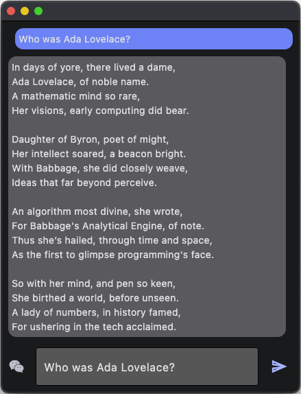

# A ai chat Flet app

A small and customisable app programmed in flet to chat with chatgpt via the openai interface. Easily customisable, clearly understandable.


First add a file named .env with your (Open-AI-Key)[https://help.openai.com/en/articles/4936850-where-do-i-find-my-openai-api-key]!

`OPENAI_API_KEY=sk-proj-...`

To run the app:

```
pip install flet
flet run 
```