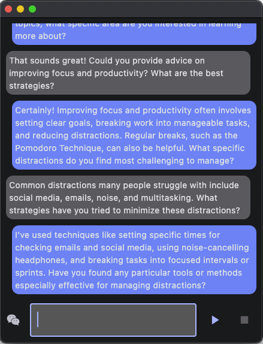

# A ai chat Flet app

A small and customisable app programmed in flet to chat with chatgpt via the openai interface. Easily customisable, clearly understandable.


First add a file named .env with your Open-AI-Key!

To run the app:

`OPENAI_API_KEY=sk-proj-...`

```
pip install flet
flet run 
```